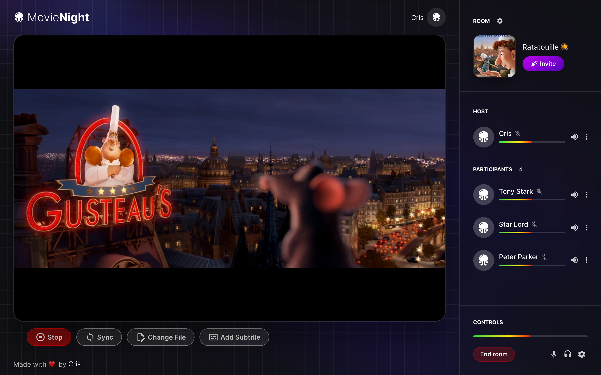
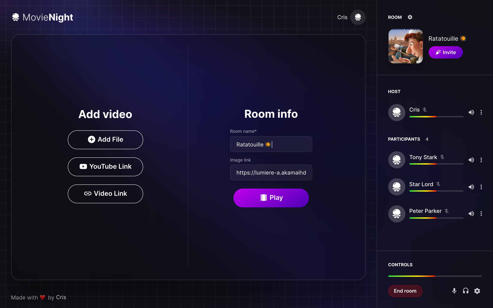
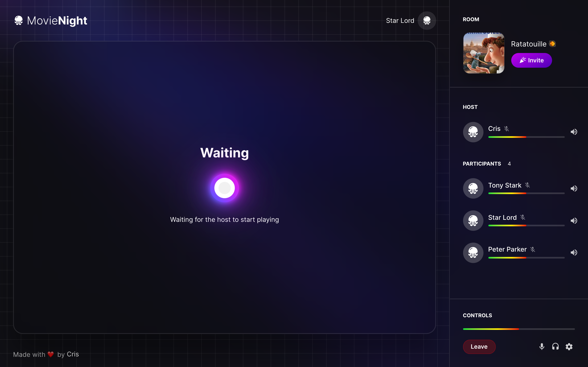

# 🍿 Movie Night

<p>
  
  <a href="#" target="_blank">
    
  </a>
</p>

> Web app to play local video files and youtube videos in sync with your friends for a great movie night!

## ⭐️ [Demo](https://movie-night-cris.netlify.app/)

## 🏙 Screenshots






## 💿 Usage

```sh
# install dependencies
$ yarn install

# serve with hot reload at localhost:3000
$ yarn dev

# build for production and launch server
$ yarn build
$ yarn start

# generate static project
$ yarn generate
```

## ‼️ Note

This is the frontend of the web app. You can get the server [here](https://github.com/emanuelchristo/movie-night-server)

## 🌳 Environment Variables

On deploying set `SERVER_URL` env var to the server's url

## 🪜 Steps

1. Create a room ➕
2. Add a name and thumbnail 🌆
3. Add video 🎬
4. Invite your friends 🕺
5. Chill 🍿

## 💎 Features

🔮 Beautiful UI  
🔥 Fast realtime updates  
⌛️ No refreshes needed  
📺 Floating video  
📄 Subtitles

## ❓ FAQs

#### 1. What can I do with this?

> Watch video (local files and youtube) in sync with your friends

#### 2. Does that mean all my friends should have the same video file?

> Yes, if you want to watch videos from you device. You can also watch youtube videos by just adding its link

#### 3. Do I have to login to use this?

> Absolutely no. All you have to give is a nickname - whatever you prefer

## 🚗 Roadmap

- Add voice chat
- Add text chat
- Responsive UI
- Add more host controls
- [Random Movie](https://github.com/emanuelchristo/random-movie) integration
- Movie brainstorming board
- Streaming
- Social media of cinephiles

## 🧑‍💻 Author

Emanuel Christo

## 🔗 Links

[](https://github.com/emanuelchristo)
[](https://www.linkedin.com/in/emanuelchristo/)
[](https://instagram.com/emanuel.christo)

## 📄 License

MIT

## Show your support

Give a ⭐️ if this project helped you!

---
